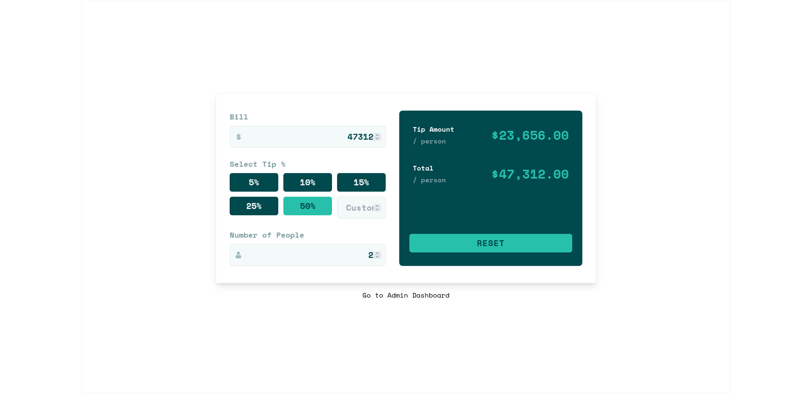

# Tip Calculator

## Home Preview



### Admin Log in


### Admin Dashboard


> **Prerequisites**  
> You should have Nodejs >= 18 and ruby >= 2.7

This app is made of core components i.e `client` for frontend and `server` for backend.

**How to start the app**

> You need to clone this repo first

>  Head over to your terminal and run the following
> 
>  ```sh
>  git clone https://github.com/katongole-isaac/relworkx.git
> ```
> 
>  ```sh
>  cd relworkx
>  ```

- **Start each module seperately**

---

- **client [Frontend]**

  - navigate to `client` directory

  ```sh
  $ cd client
  ```

  - For development

  ```sh
  $ npm install && npm run dev
  ```

  - To preview a production-ready build

  ```sh
  $ npm install && npm run build && npm run preview
  ```

  ***

- **server [Backend]**
  - navigate to `server` directory
  ```sh
  $ cd server
  ```
  - Install dependencies (gems)
  ```sh
  $ bundle install
  ```
  - Run server
  ```sh
  $ rails s
  ```
